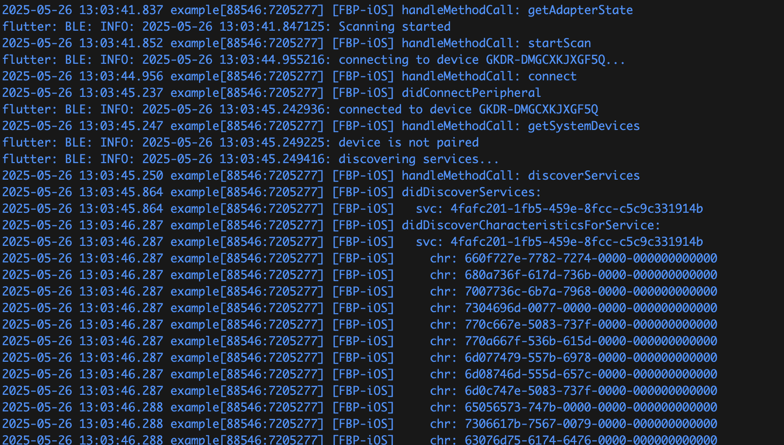

[](https://github.com/GK-Concept/gk_ble_device_flutter/actions/workflows/build.yml)
[](https://github.com/GK-Concept/gk_ble_device_flutter/actions/workflows/codeformat.yml)
[](https://github.com/GK-Concept/gk_ble_device_flutter/actions/workflows/linting.yml)

This library enables the user to connect to a GK Concept device via Bluetooth Low
Energy (BLE), to discover devices in the proximity and to subscribe to the device's
report stream, notifying the application of the device's activity.

Currently, this library only supports [Dropper](https://www.gkconcept.co/dropper/)
devices with firmware 0.8.0 and later.

The library uses the [Bloc](https://bloclibrary.dev/) library to separate business
logic from the user interface.

## Getting started

When using this library, please make sure to follow the
[FlutterBluePlus guide](https://pub.dev/packages/flutter_blue_plus#getting-started),
in particular concerning the required permissions for your app.

## Usage

All the core functionality is implemented in
[`BleDeviceCubit`](https://pub.dev/documentation/gk_ble_device_flutter/latest/ble_device_cubit/BleDeviceCubit-class.html).

A complete example with user interface can be found
[here](https://github.com/GK-Concept/gk_ble_device_flutter/blob/main/example/lib/main.dart).

## Demo

This is what the example looks like on Android:


# Multi device demo

This is what the multi device example (`example/lib/multidev_main.dart`) looks like on iOS:


Here we connect to ten Dropper devices simultaneously. Note that in particular during the
initial setup, it takes some time to establish the connections, since all calls to service
and characteristic discovery have to go through the flutter_blue_plus backend.

Initially, the device `GKDR-DMGCXKJX3EDA` was left powered off. Once all other
devices are connected, we trigger the TOF sensors on `GKDR-DMGCXKJX3ERQ` and `GKDR-DMGCXKJXFCIA`
to demonstrate how the reports from the devices are displayed as snackbars.

We then power up `GKDR-DMGCXKJX3EDA` to demonstrate the automatic connection to this device.

Finally, we disconnect `GKDR-DMGCXKJXE76A` from power and reconnect it to demonstrate that
the automatic reconnection works.

## Dropper report message format

The messages obtained from the report-stream subscription of a Dropper device have
the following format:

```json
{
  "#": 27,
  "date": "20-02-14",
  "time": "16:05:04",
  "timestamp": 1644854704,
  "report": true,
  "cycles": 2445,
  "doses": 35,
  "event": 2
}
```

With the following fields:

| field  | type | description
|--------|------|------------
| timestamp | int | UTC timestamp of the report (only relative if the system time was not set via WiFi)
| event  | int  | event code:
|        |      | 0 	(POWERON)		machine startup complete
|        |      | 1 	(DELIVERYREQ)	request to distribute a dose
|        |      | 2		(DELIVERED)		distribution successful
|        |      | 3		(PRIMEREQ)		request to prime
|        |      | 4		(PRIMED) 		priming done
|        |      | 5		(UPDATEREQ)		request to update firmware
|        |      | 6		(UPDATEOK)		update successful
|        |      | -6	(UPDATEFAIL) 	update failed
|        |      | -10	(NOHOMESW)		failure to read home switch
cycles | int  | Total number of distributions.
doses  | int  | Total number of distributions since last zero.

## Permissions for macOS

For macOS, put the following in your `Info.plist`:

```
<key>NSBluetoothAlwaysUsageDescription</key>
<string>The app uses bluetooth to find, connect and transfer data between different devices</string>
<key>NSBluetoothPeripheralUsageDescription</key>
<string>The app uses bluetooth to find, connect and transfer data between different devices</string>
```

Also, add this to `DebugProfile.entitlements` and `Release.entitlements`:

```
<key>com.apple.security.device.bluetooth</key>
<true/>
```

## Debugging

The BLE backend of this library provides control over the log level. This is
demonstrated in `main.dart` of the example application.

```dart
FlutterBluePlus.setLogLevel(LogLevel.info);
```

If you need more detailed logs, you can change this to `LogLevel.debug`. The
following screenshot illustrates what the `debug`-level logs look like when
connecting to a Dropper device:

